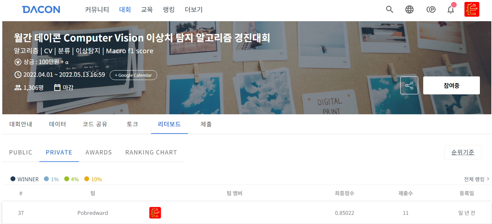

## LEADERBOARD
- Private LB 37위 / 481팀

## 대회 일정 Timeline

- 데이터 오픈: 2022년 4월 1일 금요일 10:00
- 대회 시작: 2022년 4월 1일 금요일 10:00
- 팀 병합 마감: 2022년 5월 6일 금요일 (대회 마감 1주일 전)
- 대회 종료: 2022년 5월 13일 금요일 17:00
- 코드 제출 마감: 2022년 5월 18일 수요일
- 코드 유저 평가: 2022년 5월 26일 목요일
- 최종 결과 발표: 2022년 5월 27일 금요일

## 1. 배경

안녕하세요 여러분! 😀 Computer Vision 이상 탐지(Anomaly Detection) 알고리즘 경진대회에 오신 것을 환영합니다.
MVtec AD Dataset에는 15 종류의 사물이 존재하며, 사물의 상태에 따라 이미지가 분류되어있습니다.
이번 대회에서는 사물의 종류를 분류하고, 정상 샘플과 비정상(이상치) 샘플을 분류해야 합니다.
평가 산식은 분류에서 가장 인기 있는 Macro-F1 score 입니다.
불균형 데이터 셋을 학습하여 사물의 상태를 잘 분류할 수 있는 알고리즘을 만들어 주세요.

## 2. 주제

사물의 종류와 상태를 분류하는 컴퓨터 비전 알고리즘 개발

## 3. 주최/주관

주최 및 주관: 데이콘

## 4. 참가대상

일반인, 학생 등 누구나
