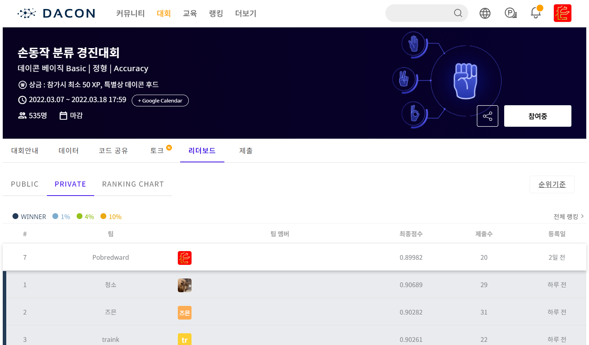

# 손동작 분류 경진대회

## **대회 일정 Timeline**

- 대회 오픈 : 2022년 3월 07일 (월) 10:00
- **대회 종료 : 2022년 03월 18일** (금) 18:00
- **코드 제출 마감 : 2022년 03월 23일** (화) 23:59
- 최종 순위 발표 : 2022년 03월 24일 (목)

## **1. 배경**

안녕하세요 여러분!🙌 **손동작 분류 경진대회**에 오신 것을 환영합니다.

총 4개의 종류의 손동작 데이터셋을 통해 **데이터 분석 대회에 입문해보세요.**

다른 사람들과 실력을 겨뤄보며 ****데이터 분석 **대회의 즐거움을 느껴보세요.**

자신만의 **시각화 방법과 분석 방법을 공유**하여 “좋아요”와 “댓글”을 모아보세요!

가장 많은 호응을 얻으신 분께는 **데이콘 후드**를 선물로 드립니다!

## **2. 목적**

손에 부착된 센서의 데이터를 통해 총 4개의 종류의 손동작을 분류해보세요!

주어진 데이터 **이외의 데이터는 사용 금지!**

## **3. 주최/주관**

주최 및 주관: 데이콘

## 4. 참가대상

일반인, 학생 등 누구나
