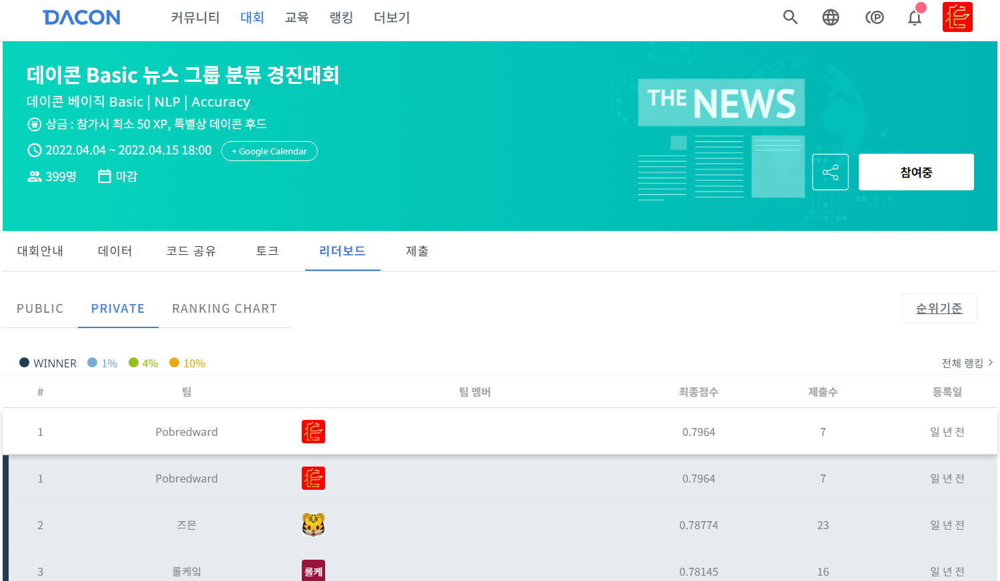

## LEADERBOARD
- Private LB 1위 / 233팀

## 대회 일정 Timeline

- 대회 오픈 : 2022년 4월 4일 (월) 11:00
- 대회 종료 : 2022년 4월 15일 (금) 18:00
- 코드 제출 마감 : 2022년 04월 19일 (화) 23:59
- 최종 순위 발표 : 2022년 04월 21일 (목)

## 1. 배경

안녕하세요 여러분!🙌 뉴스 그룹 분류 경진대회에 오신 것을 환영합니다.

뉴스 데이터셋을 이용해 뉴스 그룹을 분류해 주세요!

다른 사람들과 실력을 겨뤄보며 데이터 분석 대회의 즐거움을 느껴보세요.

자신만의 시각화 방법과 분석 방법을 공유하여 “좋아요”와 “댓글”을 모아보세요!

가장 많은 호응을 얻으신 분께는 데이콘 후드를 선물로 드립니다!

## 2. 목적

20개의 카테고리로 구분되는 영어 뉴스 데이터셋을 이용해 뉴스 그룹을 분류

주어진 데이터 이외의 데이터는 사용 금지!

## 3. 주최/주관

주최 및 주관: 데이콘

## 4. 참가대상

일반인, 학생 등 누구나
