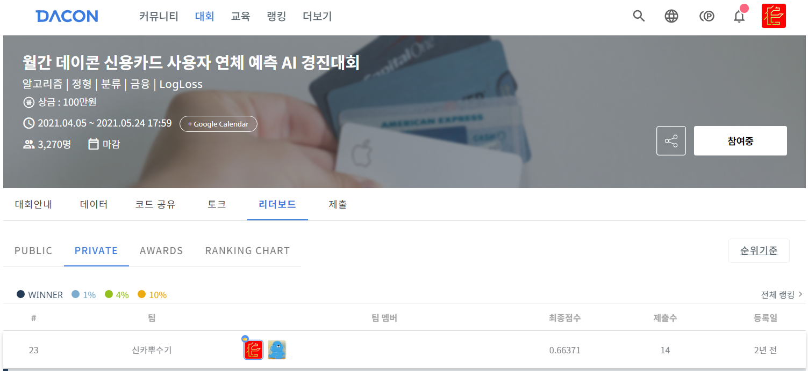

## LEADERBOARD
- Private LB 23위 / 714팀

## 대회 일정 Timeline

- 대회 기간 : 2021년 4월 5일 10:00 ~ 2021년 5월 24일 17:59
- 팀 병합 마감 : 2021년 5월 10일
- 코드 제출 : 2021년 5월 24일 ~ 2021년 5월 27일 23:59
- 코드 평가 : 참가자 코드 제출 순간 ~ 2021년 5월 31일 17:59
- 최종 순위 발표 : 2021년 5월 31일

## 1. 배경

안녕하세요 여러분! 🙌 신용카드 사용자 연체 예측 AI 경진대회에 오신 것을 환영합니다. 

신용카드사는 신용카드 신청자가 제출한 개인정보와 데이터를 활용해 신용 점수를 산정합니다. 

신용카드사는 이 신용 점수를 활용해 신청자의 향후 채무 불이행과 신용카드 대급 연체 가능성을 예측합니다. 

현재 많은 금융업계는 인공지능(AI)를 활용한 금융 서비스를 구현하고자 합니다. 

신용카드 사용자들의 개인 신상정보 데이터로 사용자의 신용카드 대금 연체 정도를 예측할 수 있는 

인공지능 알고리즘을 개발해 금융업계에 제안할 수 있는 인사이트를 발굴해주세요!

## 2. 목적

신용카드 사용자 데이터를 보고 사용자의 대금 연체 정도를 예측하는 알고리즘 개발 

## 3. 주최/주관

주최 및 주관: 데이콘

## 4. 참가대상

AI 혹은 빅데이터에 관심 있는 누구나
학교, 기업, 교육 업체 등 단체에서 자유롭게 참가 가능
